# LLM Agent System Documentation (prompt_main.md)
**Title:** LLM Agent System Documentation
**Version:** 2.0.1
**Purpose:** Single source of truth for the LLM agent development system
**Audience:** Human Developers, LLM Agents
**Last Updated:** 2025-07-18
**Change History:** ./prompt_main_change_history.md

---

## Table of Contents
1. [System Overview](#1-system-overview)
2. [Directory Structure](#2-directory-structure)
3. [Role Definitions](#3-role-definitions)
4. [File Management](#4-file-management)
5. [Workflow Process](#5-workflow-process)
6. [Configuration Files](#6-configuration-files)
7. [Template Design Guidelines](#7-template-design-guidelines)
8. [System Prompt Design](#8-system-prompt-design)
9. [Archive Strategy](#9-archive-strategy)
10. [Communication Guidelines](#10-communication-guidelines)
11. [Implementation Guide](#11-implementation-guide)
12. [Change Management and History](#12-change-management-and-history)
13. [Quick Reference](#13-quick-reference)

---

## 1. System Overview

### Purpose
A semi-automated development system using LLM agents in specific roles, with human oversight providing natural language instructions between stages.

### Core Workflow
```
Human → Consultant → Human → Planner → Human → Developer → Human → Reviewer → Human
```

### Key Principles
1. **Human-in-the-Loop**: Human provides instructions between each role
2. **Automatic I/O**: Each role knows where to find inputs and save outputs
3. **Version Control**: All artifacts are versioned semantically (no timestamps)
4. **Single Source of Truth**: This document + configuration files
5. **Clear Communication**: Standardized tone and escalation protocols

---

## 2. Directory Structure

### 2.1 Rationale
The directory structure is designed to enforce a clear separation of concerns, ensuring that different types of assets are stored in predictable locations. This approach helps both humans and agents to easily locate files and understand the system's architecture.

- **`artifacts/`**: Contains all outputs generated by the LLM agents, organized by role. This keeps generated content separate from the core system files.
- **`config/`**: Centralizes all system configuration, making it easy to manage and modify system behavior.
- **`templates/`**: Stores all templates used by the agents, organized by role. This promotes consistency and reusability.
- **`roles/`**: Contains the system prompts that define the behavior of each agent.
- **`documentation/`**: Holds all system and component documentation.
- **`scripts/`**: Includes all utility scripts used by the agents.

### 2.2 Current Implementation
```
prompt/
├── artifacts/           # All role outputs
│   ├── consultations/   # Consultant outputs
│   ├── plans/          # Planner outputs
│   ├── developments/   # Developer outputs
│   └── reviews/        # Reviewer outputs
├── config/             # System configuration (JSON)
│   ├── orchestration.json
│   ├── project_context.json
│   ├── shared_definitions.json
│   └── workflow_state.json
├── templates/          # Role-specific templates ONLY
│   ├── consultant/
│   ├── planner/
│   ├── developer/
│   └── reviewer/
├── [role_name]/        # Role system files
│   ├── [role]_system.md
│   ├── CLAUDE_[ROLE].md (if exists)
│   └── conversation.md
├── documentation/      # System documentation
├── scripts/           # Utility scripts
│   └── path_utilities.py  # Standard path resolution
└── archive/           # Historical versions
    ├── artifacts/
    ├── config/
    ├── roles/
    └── templates/
```

### Important Notes
- **Templates**: Stored ONLY in `prompt/templates/[role]/` (not in role directories)
- **Path Resolution**: All roles use `scripts/path_utilities.py` for finding files
- **No Duplicates**: Each file type has one canonical location

---

## 3. Role Definitions
This section defines the core responsibilities, inputs, and outputs for each agent role in the system. For communication protocols and interaction styles, see [Section 10](#10-communication-protocols).

### 3.1 Consultant
**Purpose**: Analyze problems, evaluate technical feasibility, and propose architectural solutions.

**Inputs**:
- Human problem description
- Component documentation from `@documentation/[component]/main.md`
- Project context from `@prompt/config/project_context.json`

**Outputs**:
- Consultation notes to `@prompt/artifacts/consultations/[component]/[task_id]/consultation_[component]_[task_id]_v[X.Y.Z]_i[N].md`

### 3.2 Planner
**Purpose**: Transform consultations and human instructions into executable, step-by-step development plans.

**Inputs**:
- Latest consultation from `@prompt/artifacts/consultations/[component]/[task_id]/consultation_[component]_[task_id]_v[X.Y.Z]_i[N].md`
- Component documentation from `@documentation/[component]/main.md`
- Standards from:
  - `@documentation/main/template_guideline.md`
  - `@documentation/main/process_guideline.md`
- Templates from `@prompt/templates/planner/`

**Outputs**:
- Development plan to `@prompt/artifacts/plans/[component]/[task_id]/plan_[component]_[task_id]_v[X.Y.Z]_i[N].md`

### 3.3 Developer
**Purpose**: Implement development plans by writing production-ready code that adheres to all project standards.

**Inputs**:
- Latest plan from `@prompt/artifacts/plans/[component]/[task_id]/plan_[component]_[task_id]_v[X.Y.Z]_i[N].md`
- Source code from `@components/[component]/`
- Standards from:
  - `@documentation/main/template_guideline.md`
  - `@documentation/main/process_guideline.md`

**Outputs**:
- Development notes to `@prompt/artifacts/developments/[component]/[task_id]/development_[component]_[task_id]_v[X.Y.Z]_i[N].md`
- Code changes to source files

### 3.4 Reviewer
**Purpose**: Ensure all code, documentation, and artifacts meet quality standards and comply with the development plan.

**Inputs**:
- Latest plan from `@prompt/artifacts/plans/[component]/[task_id]/plan_[component]_[task_id]_v[X.Y.Z]_i[N].md`
- Latest dev notes from `@prompt/artifacts/developments/[component]/[task_id]/development_[component]_[task_id]_v[X.Y.Z]_i[N].md`
- Code diff from implementation
- Test results

**Outputs**:
- Review report to `@prompt/artifacts/reviews/[component]/[task_id]/review_[component]_[task_id]_v[X.Y.Z]_i[N].md`

---

## 4. File Management

### 4.1 Versioning Rules
- **Format**: `{artifact_type}_{name}_{task_id}_v{version}_i{iteration}.md`
- **`task_id`**: Unique identifier for the task (e.g., T001).
- **`version`**: The semantic version of the *target component* being worked on.
- **`iteration`**: A simple counter for the number of times an artifact has been generated for a given phase.

This decouples the artifact version from the component version, providing clear traceability.

### 4.2 Finding Latest Version
Each role uses the script `@prompt/scripts/state_manager.py` to find the latest artifact. This script centralizes all file system interactions and ensures consistency.

**Usage Example:**
```python
# Import and initialize the state manager
from prompt.scripts.state_manager import StateManager
state_manager = StateManager()

# Get the latest artifact for a given task
latest_artifact = state_manager.get_latest_artifact(task_id="T001", artifact_type="plan")
```

### 4.3 Hierarchy
Program -> Project -> Epic (SPS) -> Work Package (Request) -> Task 

---

## 5. Workflow Process

### 5.1 Standard Flow

```mermaid
graph LR
    H1[Human] -->|Problem| C[Consultant]
    C -->|Notes| H2[Human]
    H2 -->|Instruction| P[Planner]
    P -->|Plan| H3[Human]
    H3 -->|Instruction| D[Developer]
    D -->|DevNotes| H4[Human]
    H4 -->|Instruction| R[Reviewer]
    R -->|Review| H5[Human]
    H5 -->|Route per TargetRole| Next[Next Role/Human]
```


### 5.2 Human Instructions Format
To ensure clarity, human instructions should be specific and provide sufficient context. While the system is designed to handle natural language, providing some structure can improve performance.

**Guidelines for Effective Instructions:**
- **Identify the Target:** Clearly state the component, file, or feature the task relates to (e.g., "for the `tv_ingest` component").
- **State the Goal:** Describe the desired outcome (e.g., "implement the plan," "review the code for bugs").
- **Provide Context:** Include any special requirements, constraints, or areas of focus (e.g., "pay close attention to performance implications").

**Examples:**
- **Structured:** `"Please create a development plan for the 'prompt_main' component based on the latest consultation. Focus on resolving the 7 documentation issues."`
- **Natural:** `"The documentation for the prompt system is out of date. Can you create a plan to fix the broken links and add the missing file paths?"`

### 5.3 State Tracking
The `workflow_state.json` tracks current progress:
```json
{
  "active_tasks": {
    "T001": {
      "task_type": "system_architecture",
      "target_name": "prompt_main",
      "target_version": "2.1.0",
      "active_phase": "planning",
      "latest_iteration": 1
    }
  }
}
```

---

## 6. Configuration Files
All system configuration is managed through JSON files in the `@prompt/config/` directory.

### 6.1 shared_definitions.json
**Path:** `@prompt/config/shared_definitions.json`
Core enums and constants used across all roles.
```json
{
  "statuses": ["draft", "in_progress", "ready_for_review", "completed", "blocked"],
  "artifact_types": ["consultation", "plan", "devnotes", "review"],
  "roles": ["consultant", "planner", "developer", "reviewer"],
  "verdicts": ["approved", "conditional_approval", "rejected"]
}
```

### 6.2 project_context.json
**Path:** `@prompt/config/project_context.json`
Project-specific standards and conventions.
```json
{
  "naming_conventions": {
    "data_processor": "dp_*",
    "frontend_builder": "fb_*",
    "service": "svc_*"
  },
  "documentation_paths": {
    "templates": "@documentation/main/template_guideline.md",
    "process": "@documentation/main/process_guideline.md"
  }
}
```

### 6.3 orchestration.json
**Path:** `@prompt/config/orchestration.json`
I/O mappings and workflow control. See the file for the full schema.

### 6.4 workflow_state.json
**Path:** `@prompt/config/workflow_state.json`
Tracks the current state of all active tasks. This file is automatically updated by the system.

---

## 7. Template Design Guidelines

### 7.1 Template Structure

Every template MUST contain:

```markdown
# [Role] [Artifact Type]: [Component Name]

## I. METADATA BLOCK
- **Version:** [Semantic version]
- **Author:** [Role designation]
- **Date:** [ISO 8601]
- **Status:** [From shared_definitions]
- **Dependencies:** [Related artifacts]

## II. EXECUTIVE SUMMARY
[Plain language summary for all stakeholders]

## III. TABLE OF CONTENTS

## IV. CORE CONTENT

| Level   | Markdown Header     | List Type           | Example             |
| ------- | ------------------- | ------------------- | ------------------- |
| Level 1 | `#`                 | *(none)*            | `CLIENT REQUEST`    |
| Level 2 | `##`                | Roman Numerals      | `I.`, `II.`, `III.` |
| Level 3 | `###`               | Capital Letters     | `A.`, `B.`, `C.`    |
| Level 4 | `####`              | Numbers             | `1.`, `2.`, `3.`    |
| Level 5 | `#####`             | Lowercase Roman     | `i.`, `ii.`, `iii.` |
| Level 6 | `######` (optional) | Lowercase Letters   | `a.`, `b.`, `c.`    |
| BELOW   |                     | Bullet Points (•)   | `*`                 |
| BELOW   |                     | Bullet Points (•)   | `-`, or `+`         |

## V. GLOSSARY

## VI. APPENDIX

## VII. VALIDATION CHECKLIST
- [ ] [Self-check items]

## VIII. STAKEHOLDER SIGN-OFF

## IX. NEXT STEPS
[Clear handoff to next role]

## X. CHANGELOG

```

### 7.2 Section Guidelines

#### Metadata Block
- Use semantic versioning: `major.minor.patch`
- Reference related artifacts by exact version
- Status from predefined enum in shared_definitions.json

#### Executive Summary
- Maximum 3 paragraphs
- No technical jargon
- Focus on "what" and "why"

#### Core Content
- Use subsections for organization
- Balance detail with readability
- Include examples where helpful

#### Validation Checklist
- 5-10 items maximum
- Each item must be verifiable
- Include both content and process checks

#### Next Steps
- Explicitly name the next role
- Provide specific actions
- Include any prerequisites

### 7.3 Template Types
Each role has a set of standardized templates. All templates are located in the `@prompt/templates/` directory.

**Consultant**
- `@prompt/templates/consultant/standard_consultation.md`: Default template for general analysis.
- `@prompt/templates/consultant/bug_analysis.md`: Focused template for bug investigation.

**Planner**
- `@prompt/templates/planner/standard_planning.md`: Default template for creating development plans.
- `@prompt/templates/planner/documentation_update.md`: Specialized template for documentation-only tasks.
- `@prompt/templates/planner/planner_template_documentation.md`: Template for documenting new planner templates.

**Developer**
- `@prompt/templates/developer/standard_development.md`: Default template for implementation notes.

**Reviewer**
- `@prompt/templates/reviewer/standard_review.md`: Default template for code and plan reviews.

---

## 8. System Prompt Design
System prompts define the core behavior of each LLM agent. They are located in the `@prompt/roles/` directory.

### 8.1 Prompt Architecture
Each system prompt is a Markdown file that follows a standardized structure to ensure consistency and reliability. The base prompt for each role can be found in the corresponding file:
- **Consultant:** `@prompt/roles/consultant_system.md`
- **Planner:** `@prompt/roles/planner_system.md`
- **Developer:** `@prompt/roles/developer_system.md`
- **Reviewer:** `@prompt/roles/reviewer_system.md`

#### Command File Philosophy

A `command` file is a high-level "assembly manifest." It does not contain low-level logic itself. Instead, it defines a specific task for an agent by importing and assembling a series of modular, reusable components (Profiles, Protocols, Specifications) in a standardized order.

#### The 9-Block Structure

Every command file is structured into 9 logical blocks. The orchestrator concatenates these blocks in order to create the final prompt sent to the LLM.

| # | Block | Key Contents & Purpose | Implementation Notes |
|---|---|---|---|
| **0** | **Metadata / Header** | Title, version, status, description. | Standard YAML frontmatter. `name` should be unique. |
| **1** | **Global / Project Context** | Domain standards and shared definitions. | This is typically injected by the session manager/CLI, not imported directly in the command file. |
| **2** | **Role Identity & Competencies** | The agent's core persona: who it is, what it knows, and its core mandate. | **MUST** import the role's central `[role]_profile.md` file. This should be consistent across most commands for a given role. |
| **3** | **Skills & Toolbox** | Function schemas or textual descriptions of allowed tools/APIs. | *(Future Implementation)* This block is currently a placeholder for forward compatibility. |
| **4** | **Knowledge Base** | A canonical list of source-of-truth documents the agent must use (e.g., manifest, TPG, TSG). | **MUST** import from a shared `knowledge_base_[artifact_type].md` file to ensure all tasks for an artifact use the same references. |
| **5** | **Execution Protocol** | The specific, numbered, step-by-step instructions for *this command's task*. | **MUST** import from a shared `execution_protocol_[artifact_type].md` |
| **6** | **Behavioral Guardrails / Escalation** | Tone rules, refusal logic (Hard Gates), ambiguity handling, and escalation paths. | **MUST** import from a shared `guardrails_[artifact_type].md` file. Command-specific overrides can be added directly below the import if absolutely necessary. |
| **7** | **Quality & Success Criteria** | The checklist of standards the agent's output must meet. Used for self-validation. | **MUST** import from a shared `quality_criteria_[artifact_type].md` file. |
| **8** | **Role-Specific Exemplars** | Few-shot snippets (e.g., sample questions, AC formats). | *(Future Implementation)* This block is currently a placeholder. It will likely import from an `examples` directory. |
| **9** | **I/O Specification** | Exact input parameters, output paths/patterns, and completion commands. | **MUST** import from a shared `io_specification_[artifact_type].md` file. |

#### Example Implementation: `consultant/request.md`

Every system prompt follows this structure:

```markdown
<!-- BLOCK 0: METADATA -->
---
name: Consultant | Create Request
description: Activates the LLM_Consultant to initiate a new request artifact.
version: 1.1.0
---

<!-- BLOCK 2: ROLE IDENTITY & COMPETENCIES -->
@prompt/roles/consultant/consultant_profile.md

<!-- BLOCK 3: SKILLS & TOOLBOX -->
@prompt/roles/consultant/shared_specs/toolbox_skills.md

<!-- BLOCK 4: KNOWLEDGE BASE REFERENCES -->
@prompt/roles/consultant/shared_specs/knowledge_base_request.md

<!-- BLOCK 5: EXECUTION PROTOCOL & SKILLS -->
@prompt/roles/consultant/shared_specs/execution_protcol_request.md

<!-- BLOCK 6: BEHAVIORAL GUARDRAILS / ESCALATION -->
@prompt/roles/consultant/shared_specs/guardrails_request.md

<!-- BLOCK 7: QUALITY & SUCCESS CRITERIA -->
@prompt/roles/consultant/shared_specs/quality_criteria_request.md

<!-- BLOCK 8: EXAMPLARS -->

<!-- BLOCK 9: I/O SPECIFICATION -->
@prompt/roles/consultant/shared_specs/io_specification_request.md
```

### 8.2 Shared Context Injection
All prompts reference shared configurations:
- Load from `@prompt/config/shared_definitions.json`
- Apply project context from `@prompt/config/project_context.json`
- Check current state in `@prompt/config/workflow_state.json`

### 8.3 Dynamic Assembly
System prompts are assembled at runtime:
```
final_prompt = base_prompt + shared_context + task_context
```

---

## 9. Archive Strategy

The maintenance, versioning, and archival of this document are governed by the standards and scripts defined in `@documentation/general.md`. This document follows the authoritative update workflow defined there.

All LLM agents and human developers must reference `@documentation/general.md` for:
- Archive directory structure and naming conventions
- Version numbering standards
- Automated update workflows
- Change history management

---

## 10. Communication Protocols
This section defines the communication standards, styles, and escalation procedures for all roles. For role-specific responsibilities, see [Section 3](#3-role-definitions).

### 10.1 General Principles
- **Clarity First**: Avoid ambiguity. Be explicit and direct.
- **Constructive Tone**: Frame feedback and instructions in a positive, solution-oriented manner.
- **Use Examples**: Illustrate complex points with concrete examples.
- **Standardized Tags**: Use tags like [BLOCKED], [CLARIFICATION NEEDED], and [CRITICAL] for clear signaling.

### 10.2 Role-Specific Styles

#### Consultant
- **Tone**: Analytical, educational, and exploratory.
- **Focus**: Presenting multiple options, explaining trade-offs, and providing clear rationale.

#### Planner
- **Tone**: Precise, actionable, and detailed.
- **Focus**: Creating unambiguous, step-by-step plans and anticipating implementation challenges.

#### Developer
- **Tone**: Technical, clear, and focused.
- **Focus**: Documenting implementation decisions, flagging uncertainties early, and providing clear status updates.

#### Reviewer
- **Tone**: Constructive, specific, and solution-oriented.
- **Focus**: Providing actionable feedback with specific line references and a clear verdict with reasoning.

### 10.3 Escalation Protocol
When work is blocked or requires clarification:
1. **Tag the artifact** with the appropriate severity: `[CRITICAL]`, `[MAJOR]`, or `[MINOR]`.
2. **Clearly state the issue** in the artifact's summary.
3. **Propose potential solutions** or next steps.
4. **Request human intervention** if the issue cannot be resolved by the next role.

---

## 11. Implementation Guide

### 11.1 Setting Up a New Component

1. **Create component documentation**:
   ```
   @documentation/[component_name]/
   ├── main.md
   └── change_history.md
   ```

2. **Initialize in workflow_state.json**:
   ```json
   {
     "active_workflows": {
       "[component_name]": {
         "current_phase": "consultation",
         "current_version": "0.0.0"
       }
     }
   }
   ```

### 11.2 Role Execution Checklist

**For each role:**
- [ ] Read human instruction for component name
- [ ] Check workflow_state.json for current version
- [ ] Fetch required inputs using path_utilities.py
- [ ] Load appropriate template
- [ ] Execute role-specific tasks
- [ ] Save output with next version number
- [ ] Update workflow_state.json

### 11.3 Version Increment Logic
```python
def get_next_version(current_version, change_type):
    major, minor, patch = map(int, current_version.split('.'))
    
    if change_type == "breaking":
        return f"{major+1}.0.0"
    elif change_type == "feature":
        return f"{major}.{minor+1}.0"
    else:  # patch (default for any edit)
        return f"{major}.{minor}.{patch+1}"
```

---

## 12. Change Management and History

### 12.1 Document Maintenance
This document is governed by the standards and workflows defined in the [General Documentation Guidelines](../../documentation/general.md). All updates must follow the authoritative update workflow outlined there.

### 12.2 Versioning
This document follows the semantic versioning guidelines outlined in the general documentation. Each update will increment the version number according to the scope and impact of the changes.

### 12.3 Change History
A detailed log of all versions is available in the [Prompt Main Change History file](prompt_main_change_history.md).

---

## 13. Quick Reference

### 13.1 Common Paths
```
# Latest consultation for a task
@prompt/artifacts/consultations/[component]/[task_id]/consultation_[component]_[task_id]_v[X.Y.Z]_i[N].md

# Latest plan for a task
@prompt/artifacts/plans/[component]/[task_id]/plan_[component]_[task_id]_v[X.Y.Z]_i[N].md

# Latest development notes for a task
@prompt/artifacts/developments/[component]/[task_id]/development_[component]_[task_id]_v[X.Y.Z]_i[N].md

# Latest review for a task
@prompt/artifacts/reviews/[component]/[task_id]/review_[component]_[task_id]_v[X.Y.Z]_i[N].md

# Component documentation
@documentation/[component]/main.md

# Project standards
@documentation/main/template_guideline.md
@documentation/main/process_guideline.md

# Configuration
@prompt/config/[config_name].json

# State Manager
@prompt/scripts/state_manager.py
```

### 13.2 Role Commands

**Consultant**:
```
Input: Human problem description
Output: @prompt/artifacts/consultations/[component]/[task_id]/consultation_[component]_[task_id]_v[X.Y.Z]_i[N].md
```

**Planner**:
```
Input: @prompt/artifacts/consultations/[component]/[task_id]/consultation_[component]_[task_id]_v[X.Y.Z]_i[N].md
Output: @prompt/artifacts/plans/[component]/[task_id]/plan_[component]_[task_id]_v[X.Y.Z]_i[N].md
```

**Developer**:
```
Input: @prompt/artifacts/plans/[component]/[task_id]/plan_[component]_[task_id]_v[X.Y.Z]_i[N].md
Output: @prompt/artifacts/developments/[component]/[task_id]/development_[component]_[task_id]_v[X.Y.Z]_i[N].md
```

**Reviewer**:
```
Input: 
  - @prompt/artifacts/plans/[component]/[task_id]/plan_[component]_[task_id]_v[X.Y.Z]_i[N].md
  - @prompt/artifacts/developments/[component]/[task_id]/development_[component]_[task_id]_v[X.Y.Z]_i[N].md
Output: @prompt/artifacts/reviews/[component]/[task_id]/review_[component]_[task_id]_v[X.Y.Z]_i[N].md
Headers: TargetRole, Severity
```

### 13.3 Human Instruction Templates

**To Consultant**:
```
"Please analyze the [problem description] for the [component] component 
and provide architectural recommendations."
```

**To Planner**:
```
"Please create a development plan for the [component] component based on 
the latest consultation. [Additional requirements]."
```

**To Developer**:
```
"Please implement the latest plan for the [component] component. 
[Special considerations]."
```

**To Reviewer**:
```
"Please review the implementation for the [component] component against 
the plan and development notes."
```

---

